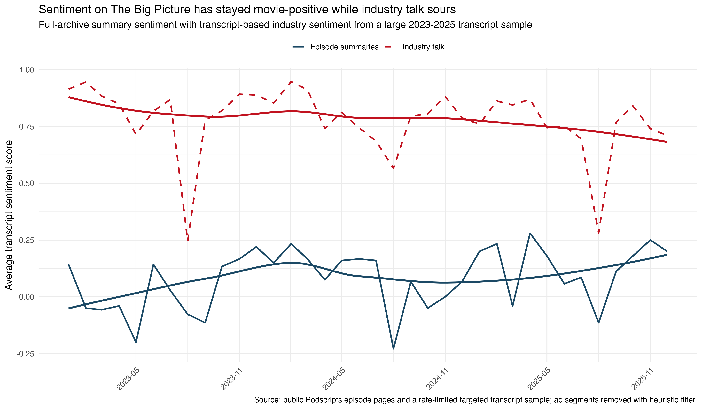
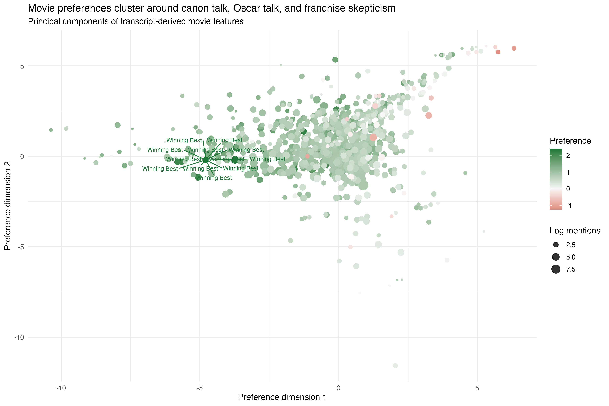

```{r}
library(readr)
library(dplyr)
library(knitr)
library(scales)

fmt_int <- function(x) formatC(as.integer(round(x)), format = "d", big.mark = ",")

run_summary <- read_csv("../data/processed/run_summary.csv", show_col_types = FALSE)
metrics <- setNames(run_summary$value, run_summary$metric)
episode_manifest <- read_csv("episode_manifest.csv", show_col_types = FALSE)
transcript_manifest <- read_csv("transcript_manifest.csv", show_col_types = FALSE)
sentiment_tab <- read_csv("tab_sentiment_model.csv", show_col_types = FALSE)
movie_commonalities <- read_csv("tab_movie_commonalities.csv", show_col_types = FALSE)
movie_scores <- read_csv("movie_scores.csv", show_col_types = FALSE)
oscar_eval <- read_csv("oscar_prediction_evaluation.csv", show_col_types = FALSE)
oscar_evidence <- read_csv("tab_oscar_evidence_weights.csv", show_col_types = FALSE)

episode_min <- min(episode_manifest$episode_date, na.rm = TRUE)
episode_max <- max(episode_manifest$episode_date, na.rm = TRUE)
recent_min <- min(as.Date(episode_manifest$episode_date[as.Date(episode_manifest$episode_date) >= as.Date("2023-01-01")]), na.rm = TRUE)
recent_max <- max(as.Date(episode_manifest$episode_date[as.Date(episode_manifest$episode_date) >= as.Date("2023-01-01")]), na.rm = TRUE)

movie_preview <- movie_scores |>
  select(movie, n_episodes, total_mentions, preference_score) |>
  arrange(desc(preference_score)) |>
  head(10)

oscar_overall_accuracy <- mean(oscar_eval$correct, na.rm = TRUE)
oscar_revision_n <- sum(oscar_eval$revision, na.rm = TRUE)
oscar_horizon_summary <- oscar_eval |>
  mutate(
    horizon_bucket = factor(
      horizon_bucket,
      levels = c("Early season", "Post-noms / precursor stretch", "Final month")
    )
  ) |>
  group_by(horizon_bucket) |>
  summarise(
    Episodes = n(),
    Accuracy = mean(correct, na.rm = TRUE),
    Revisions = sum(revision, na.rm = TRUE),
    .groups = "drop"
  ) |>
  arrange(horizon_bucket) |>
  mutate(Accuracy = percent(Accuracy, accuracy = 1))

oscar_season_summary <- oscar_eval |>
  arrange(oscar_season, episode_date) |>
  group_by(oscar_season) |>
  summarise(
    Episodes = n(),
    Accuracy = mean(correct, na.rm = TRUE),
    Revisions = sum(revision, na.rm = TRUE),
    Last_pick = dplyr::last(contender),
    Winner = dplyr::last(winner),
    .groups = "drop"
  ) |>
  mutate(Accuracy = percent(Accuracy, accuracy = 1))

oscar_evidence_display <- oscar_evidence |>
  mutate(
    evidence_type = recode(
      evidence_type,
      star_power = "star power / filmmaker prestige",
      festival = "festival chatter",
      priors = "Academy priors",
      campaign = "campaign strength",
      narrative = "narrative / momentum",
      guild = "guild signals",
      release_timing = "release timing",
      box_office = "box office"
    ),
    across(
      c(mean_mentions, mean_mentions_revision_episodes, mean_mentions_correct_episodes),
      ~ round(.x, 1)
    )
  ) |>
  select(
    `Evidence type` = evidence_type,
    `Mean mentions` = mean_mentions,
    `Revision episodes` = mean_mentions_revision_episodes,
    `Correct episodes` = mean_mentions_correct_episodes
  )
```

# Why study *The Big Picture*?

*The Big Picture* matters because it is not just a movie-review show. Sean
Fennessey, Amanda Dobbins, and their rotating collaborators do three things at
once: they evaluate films as works of art, they talk about the health of the
movie business, and they make public Oscar arguments.

That makes the show a useful case study in cultural judgment.
If we can build a clean transcript-backed dataset, we can ask three concrete
questions:

1. Does the show become more pessimistic or more upbeat over time?
2. What kinds of movies reliably attract praise?
3. What sort of evidence seems to drive the hosts' Oscar forecasting?

The current evidence is still uneven. The public web gives us excellent
coverage of episode metadata and summaries, but only partial coverage of full
transcripts. So this draft can speak confidently about broad sentiment trends,
more tentatively about repeated movie praise, and now in a bounded but real
way about Oscar prediction.

# Data

The project currently combines two layers of public data:

- A near-complete episode manifest from public Podscripts listing pages.
- A growing cached transcript corpus from public Podscripts episode pages.

In the current build:

- The full manifest covers **`r fmt_int(metrics[['episodes_total']])` episodes**
  from **`r episode_min`** through **`r episode_max`**.
- The recent summary-based analytic sample covers
  **`r fmt_int(metrics[['episodes_summary_sample']])` episodes** from
  **`r recent_min`** through **`r recent_max`**.
- The transcript cache currently contains
  **`r fmt_int(sum(transcript_manifest$transcript_available, na.rm = TRUE))`
  pages**, yielding
  **`r fmt_int(sum(coalesce(transcript_manifest$usable_segments, 0)))` usable
  transcript segments** after basic filtering.

That split drives the whole project:

- summary coverage supports the sentiment time series
- transcript coverage supports the deeper movie and Oscar analysis
- the current transcript cache is now large enough to support a defensible
  first Oscar audit, even though the movie and speaker-level layers remain
  incomplete

The replication code lives in
[`../replication/README.md`](../replication/README.md).
It is code-only by design and does not commit full transcript dumps.

## Workflow map

| Input layer | Coverage | Supports |
|---|---:|---|
| Episode manifest | `r fmt_int(metrics[['episodes_total']])` episodes | archive-wide counts and episode typing |
| Episode summaries | `r fmt_int(metrics[['episodes_summary_sample']])` recent episodes | sentiment-over-time results |
| Cached transcripts | `r fmt_int(sum(transcript_manifest$transcript_available, na.rm = TRUE))` recent episodes / `r fmt_int(sum(coalesce(transcript_manifest$usable_segments, 0)))` segments | movie and Oscar exploration |

# Methods

## How one observation becomes evidence

One episode can contribute to the project in two different ways.

- Its summary enters the broad sentiment time series.
- If its transcript page is cached, each transcript segment can also be scored
  for evaluative tone and for whether it is about the movie business rather than
  a specific film.

That means the unit of analysis changes by question. For the trend question, I
mostly use episode summaries. For the movie and Oscar questions, I use cached
transcript segments and then aggregate back up to the movie or episode level.

## Sentiment

I use a layered design rather than treating one off-the-shelf label as truth.

- Episode summaries provide the broad time series.
- Cached transcript segments provide a narrower but richer signal.
- Industry-related talk is identified with a custom keyword layer covering box
  office, streaming, studios, theaters, franchises, guilds, festivals, and
  awards infrastructure.
- Positive and negative evaluative phrases are treated as additional cues, not
  as a substitute for context.

## Movie preference

Movie scoring is harder than sentiment trending because many capitalized
phrases in transcripts are not film titles. The current score is therefore a
conservative exploratory measure, not a final ranking.

The current score combines:

- repeated mentions across episodes
- segment-level sentiment
- positive and negative evaluative phrase rates
- episode context such as Oscar coverage or canon/ranking episodes

## Oscars

For Oscars, the relevant unit is the episode-level prediction event: an episode
in which the hosts sound like they are naming, leaning toward, revising, or
implicitly power-ranking a Best Picture choice.

In the current build, a prediction event must satisfy three conditions:

- the episode is Oscar-focused and occurs before the ceremony
- the transcript contains a Best Picture discussion window or a whole-episode
  ranking segment
- one contender has the strongest combination of explicit pick language,
  tentative lean language, Best Picture cues, and repeated mention volume

A revision is any within-season episode where the inferred frontrunner changes
relative to the prior sampled prediction episode. Accuracy is then defined
against the realized Best Picture winner for that season. This is still a
heuristic extractor, not hand coding, so I treat the results as a bounded audit
of public forecasting talk rather than as a perfect reconstruction of private
beliefs. In a few ranking-format episodes, the inferred pick comes from the
ordering and repetition of contenders rather than from an explicit "will win"
statement.

# Results

## 1. The show is still pro-movie, and industry-heavy episodes sound less upbeat

The broadest finding is the clearest one: the podcast remains culturally
enthusiastic about movies, but the less upbeat segments are disproportionately
the ones focused on the business surrounding them.



The summary-backed series stays positive on average. The transcript-backed
industry line is noisier and often lower. The first-pass regression in
[`tab_sentiment_model.csv`](tab_sentiment_model.csv) does not cleanly identify
an over-time decline, but it does show that episodes with more industry-coded
talk are less positive on average.

```{r}
sentiment_tab |>
  filter(term %in% c("industry_share", "positive_phrase_rate", "negative_phrase_rate")) |>
  mutate(
    Read = c(
      "more industry-heavy episodes are less upbeat",
      "explicit praise predicts more positive tone",
      "explicit criticism predicts sharply worse tone"
    )
  ) |>
  select(`Sentiment model term` = term, Coefficient = estimate, Read) |>
  kable(digits = 3)
```

That lines up with the content of the episodes themselves. The show can sound
energized by individual movies and simultaneously worried about:

- streaming-driven release confusion
- the fragility of adult theatrical movies
- studio overreliance on franchise logic
- the awards ecosystem as a distorted substitute for genuine movie health

The cultural mood is not simply "movies are bad now." A better current summary
is: the show still likes movies, but business-focused episodes are where the
anxiety lives.

## 2. The current cached sample is much better at recovering praise than contempt

The movie-preference section is the least settled part of the project. The
currently cached transcript pages overrepresent ranking episodes, canon
episodes, Hall of Fame episodes, and other formats that naturally generate
positive talk.

That creates two asymmetries:

- the current sample is much better at finding what the hosts repeatedly praise
- it is worse at finding sustained dislike, because negative judgments are less
  often the main event of these cached episodes

For that reason, I now treat the movie layer as a **seeded-title** exercise
rather than a free-form title extraction pass. The scored movies come from a
conservative list of headline films and Oscar contenders that can be matched
reliably in the cached transcripts. Within that narrower frame, the strongest
positive evidence tends to cluster around:

- canonized auteur films
- prestige dramas with strong directorial signatures
- older theatrical movies that support "movie movie" arguments
- rewatchable mainstream films that also feel culturally durable

The current exploratory commonality table reflects that tilt:

```{r}
movie_commonalities |>
  mutate(across(where(is.numeric), ~ round(.x, 3))) |>
  rename(
    Feature = feature,
    `More-liked side` = liked_mean,
    `Less-liked side` = disliked_mean,
    Gap = gap
  ) |>
  kable()
```

Operationally, the "more-liked" side means seeded titles with more repeated
mentions, more positive evaluative language, and fewer negative cues across the
cached sample. The stable descriptive pattern is modest rather than grand:
liked titles show more repeated mention volume and somewhat less franchise
association. This is useful evidence, but it is still an exploratory map rather
than a final census of the hosts' taste.

```{r}
movie_preview |>
  transmute(
    Movie = movie,
    Episodes = n_episodes,
    Mentions = total_mentions,
    Preference_score = preference_score
  ) |>
  kable(digits = 3)
```



## 3. The Oscar model is sticky, theory-driven, and highly season-sensitive

The Oscar layer is now real enough to say something concrete. The current cache
contains **`r fmt_int(nrow(oscar_eval))` pre-ceremony Best Picture forecast
episodes** across the 2023, 2024, and 2025 Oscar seasons. Across those
episodes, the inferred frontrunner changes only
**`r fmt_int(oscar_revision_n)` times**, so the show's public forecasting style
looks sticky rather than hyper-reactive.

That stickiness is not the same thing as accuracy. Overall accuracy in the
current audited sample is **`r percent(oscar_overall_accuracy, accuracy = 1)`**,
but almost all of the success comes from one season:

```{r}
oscar_season_summary |>
  kable()
```

The 2024 cycle looks sharp. Once the show moves onto *Oppenheimer*, it mostly
stays there and is right in six of seven sampled pre-ceremony episodes. The
other two seasons tell the opposite story. In the sampled 2023 episodes the
show stays attached to *Tar* while *Everything Everywhere All at Once* wins,
and in the sampled 2025 episodes the inferred picks rotate among *The
Brutalist*, *Wicked*, and *Nickel Boys* while *Anora* wins.

That pattern suggests a working forecasting model with two parts. First, the
hosts clearly use stable priors about filmmaker stature, prestige positioning,
and what feels like a "Best Picture movie." Second, that model works best when
the consensus race aligns with an obvious prestige juggernaut. It looks more
fragile when the field is unsettled or when the eventual winner emerges from a
less straightforward prestige script.

Horizon results reinforce the "bounded, not mechanical" reading:

```{r}
oscar_horizon_summary |>
  kable()
```

Accuracy does **not** rise monotonically as Oscar night approaches. In this
sample the early-season episodes actually outperform the middle stretch, and
the final month recovers only partially. With just
`r fmt_int(nrow(oscar_eval))` episodes, that could reflect noise, but it also
fits a substantive interpretation: the show does not merely trail consensus in
a straight line. It sometimes locks into a coherent theory of the race and then
sticks with it even when the field moves.

The evidence-coding table clarifies what that theory is built from:

```{r}
oscar_evidence_display |>
  kable()
```

These are descriptive mention counts, not causal weights, and the top category
is intentionally broad. The most common evidence family is **star power /
filmmaker prestige**, followed by **festival chatter**, **Academy priors**, and
**campaign strength**. So the pattern should be read directionally, not as a
precise ranking of causal importance. Still, it looks less like a pure
precursor spreadsheet and more like a mixed cultural-industry model: Who made
the movie, what aura did it acquire on the circuit, what kind of thing does the
Academy usually bless, and how strong does the campaign feel?

Two subtler patterns stand out. First, revision episodes are especially heavy
on campaign, narrative, and priors talk, which fits the idea that prediction
changes happen when the hosts are talking themselves through a changing awards
story. Second, correct episodes show relatively stronger guild and release
timing signals than the overall baseline, hinting that the model gets sharper
when it leans a bit more on institutional breadcrumbs and a bit less on mood.

# What we learned

The strongest conclusion is about duality. *The Big Picture* has not simply
become gloomy. Its affection for movies remains robust even as its confidence
in the surrounding industrial order has softened. And its Oscar talk sits right
at the intersection of those two impulses: cultural judgment on one side,
industry theory on the other.

That distinction matters because it clarifies what kind of criticism the show
actually practices. The hosts are not just handing out thumbs up and thumbs
down. They toggle between:

- aesthetic judgment
- institutional diagnosis
- prestige-race modeling

The first of those remains upbeat more often than the second. When the show is
forecasting the Oscars, it is often translating taste into an institutional
story about what kind of movie the Academy wants to reward. Sometimes that
translation is excellent. Sometimes it is exactly where the misses happen.

# Limitations

- The public transcript mirror appears rate-limited, so transcript completeness
  is still evolving.
- Speaker attribution is not currently available in the public transcript
  source.
- The movie-preference layer now uses a conservative seeded-title list to avoid
  obvious non-movie entities, but it still understates the full universe of
  films discussed on the show.
- Oscar prediction accuracy is now measurable, but only from a heuristic sample
  of `r fmt_int(nrow(oscar_eval))` forecast episodes and without speaker
  attribution.
- Best Picture section extraction is rule-based rather than hand-coded, so some
  episode-level picks may still compress more nuanced on-air disagreement.

# Next steps

The immediate path forward is now narrower:

1. keep the broad transcript fetcher running
2. rerun the cache-only analysis as coverage improves
3. tighten movie-title extraction with a more conservative title-recognition
   layer
4. hand-validate a sample of Oscar episodes and, if possible, recover
   speaker-level disagreement so Sean, Amanda, and guests can be separated

That is the right next step for the current data, not a retreat from the
project.
